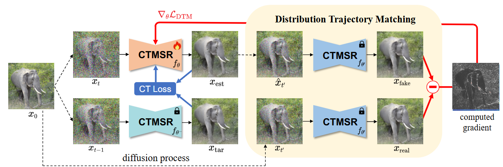
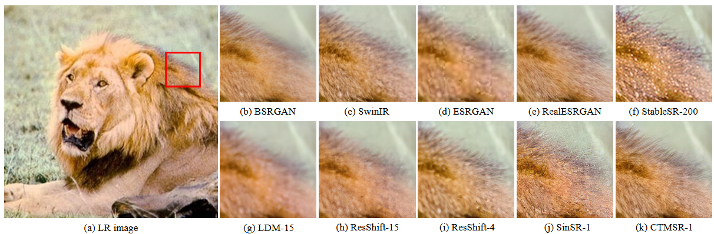

# Joint Geometric and Trajectory Consistency Learning for One-Step Real-World Super-Resolution

<div align="center">

🎉  **Accepted by ICML 2026**

Chengyan Deng<sup>1</sup>, Zhangquan Chen<sup>2</sup>, Li Yu<sup>1†</sup>, Kai Zhang<sup>3</sup>, Xue Zhou<sup>1</sup>, Wang Zhang<sup>1</sup>

<sup>1</sup>University of Electronic Science and Technology of China  
<sup>2</sup>Tsinghua University  
<sup>3</sup>Nanjing University  

[](https://arxiv.org/abs/2602.24240)
[](https://github.com/Blazedengcy/GTASR)

⭐ If this work is helpful for you, please help star this repo. Thanks! 🤗




</div>

## Abstract

Diffusion-based Real-World Image Super-Resolution (Real-ISR) achieves impressive perceptual quality but suffers from high computational costs due to iterative sampling. While recent distillation approaches leveraging large-scale Text-to-Image (T2I) priors have enabled one-step generation, they are typically hindered by prohibitive parameter counts and the inherent capability bounds imposed by teacher models. As a lightweight alternative, Consistency Models offer efficient inference but struggle with two critical limitations: the accumulation of consistency drift inherent to transitive training, and a phenomenon we term "Geometric Decoupling" where the generative trajectory achieves pixel-wise alignment yet fails to preserve structural coherence. To address these challenges, we propose GTASR (Geometric Trajectory Alignment Super-Resolution), a simple yet effective consistency training paradigm for Real-ISR. Specifically, we introduce a Trajectory Alignment (TA) strategy to rectify the tangent vector field via full-path projection, and a Dual-Reference Structural Rectification (DRSR) mechanism to enforce strict structural constraints. Extensive experiments verify that GTASR delivers superior performance over representative baselines while maintaining minimal latency.

## Environment

- Python 3.9
- PyTorch 2.0.1

### Installation

```bash
git clone https://github.com/Blazedengcy/GTASR.git
cd GTASR

conda create -n gtasr python=3.9
conda activate gtasr

pip install -r requirements.txt
python setup.py develop
```

## Training

### Data Preparation

Download the training dataset [ImageNet](https://image-net.org/challenges/LSVRC/2012/2012-downloads.php) and update the paths in `options/train`.

### Training Commands

Refer to the training configuration files in `./options/train` for detailed settings.

```bash
# batch size = 4 GPUs x 8 per GPU
CUDA_VISIBLE_DEVICES=0,1,2,3 python -m torch.distributed.launch --use-env --nproc_per_node=4 --master_port=1145 basicsr/train.py -opt options/train/ctmsr_train.yml --launcher pytorch --phase firstphase
```

```bash
# batch size = 2 GPUs x 6 per GPU
CUDA_VISIBLE_DEVICES=0,1 python -m torch.distributed.launch --use-env --nproc_per_node=2 --master_port=1145 basicsr/train.py -opt options/train/ctmsr_train.yml --launcher pytorch --phase secondphase
```

## Testing

### Data Preparation

Download and generate the testing data, then update the paths in `options/test`.

### Pretrained Models

Put pretrained model files in the project root or update `pretrain_network_g` in the test configuration.

### Testing Commands

Refer to the testing configuration files in `./options/test` for detailed settings.

```bash
CUDA_VISIBLE_DEVICES=0 python basicsr/test.py -opt options/test/ctmsr_test.yml
```

## Evaluation Metrics

```bash
python test_metrics.py \
  --inp_imgs GTASR/results/ctmsr_test/visualization/ImageNet \
  --gt_imgs imagenet256/gt \
  --log preset/metrics
```


## Citation

```bibtex
@article{deng2026joint,
  title={Joint geometric and trajectory consistency learning for one-step real-world super-resolution},
  author={Deng, Chengyan and Chen, Zhangquan and Yu, Li and Zhang, Kai and Zhou, Xue and Zhang, Wang},
  journal={arXiv preprint arXiv:2602.24240},
  year={2026}
}
```

## Acknowledgements

This code is built on [BasicSR](https://github.com/XPixelGroup/BasicSR) and [CTMSR](https://github.com/LabShuHangGU/CTMSR).
